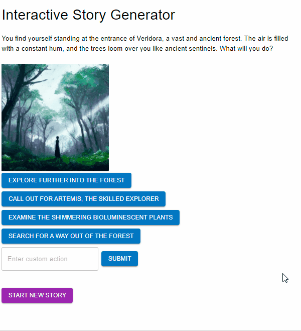

# About

This is an interactive story generator. It uses AI (OpenAI GPT) to create endless stories that the player can influence the direction of by choosing what happens next.

- This is the back-end (Python/Flask) for the interactive story generator, in order to run the app locally you will need to setup the front-end (HTML, Javascript, css) as well: https://github.com/DavidjMarkham/InteractiveStoryGeneratorFrontend
- This python-based web api was created with Flask
- App runs on port 5000 by default

## Installation
- Get an OpenAI API key (they have a free trial)
    - Goto [OpenAI's official platform website](https://platform.openai.com/).
    - Create an account and sign into it
    - Once you've created an account or have logged into an existing account, you'll see your name and your profile icon at the top-right corner of OpenAI's platform homepage.
    - To get an API Key, click on your name in the top-right corner to bring up a dropdown menu. Then, click the "View API keys" option.
    - Click "Create new secret key"
- Download and install [Python](https://www.python.org/downloads/)
- Download and install [PIP](https://pip.pypa.io/en/stable/installation/)
- `cp env.example .env`
- In .env replace 'xxxx' in line `OPENAI_API_KEY=xxxx`` with your Open API key
- `pip install -r requirements.txt`
- `python app.py`